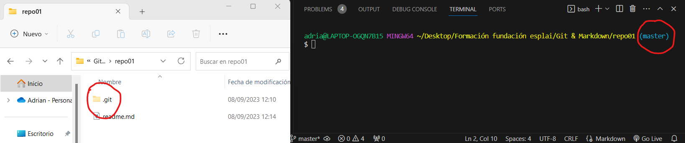
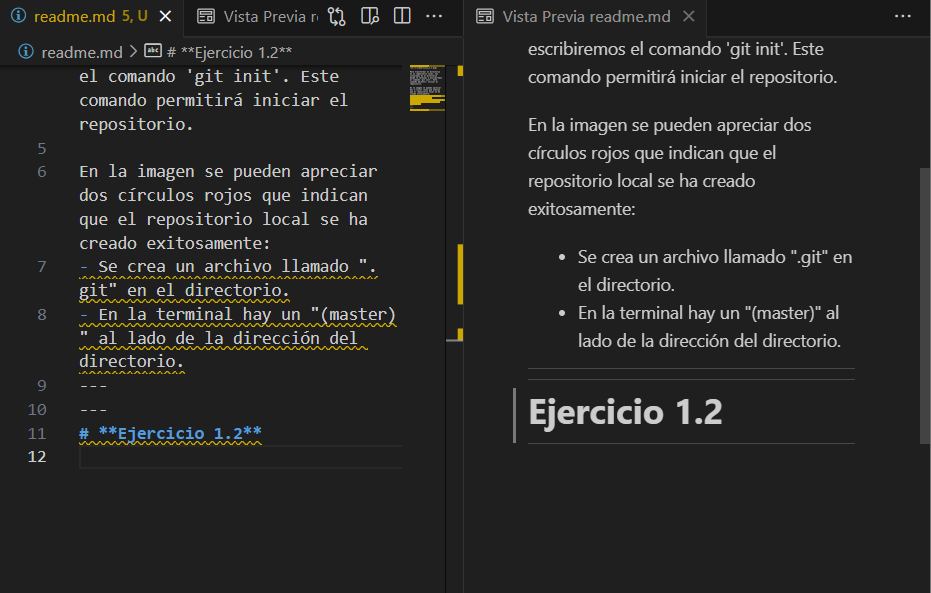
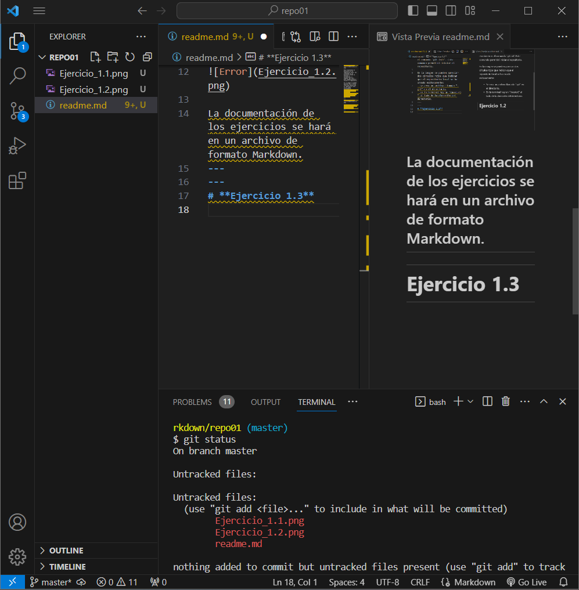
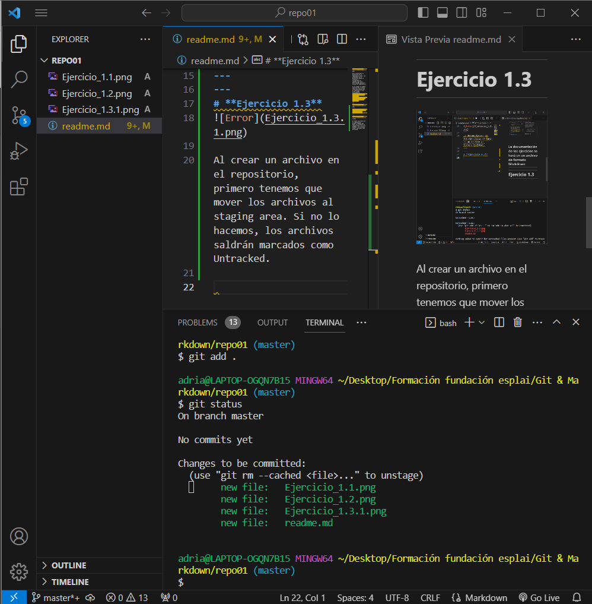

# **Ejercicio 1.1**

Para transformar el directorio en un repositorio local, nos situaremos en el directorio desde la terminal y escribiremos el comando 'git init'. Este comando permitirá iniciar el repositorio.

En la imagen se pueden apreciar dos círculos rojos que indican que el repositorio local se ha creado exitosamente:
- Se crea un archivo llamado ".git" en el directorio.
- En la terminal hay un "(master)" al lado de la dirección del directorio.
---
---
# **Ejercicio 1.2**

La documentación de los ejercicios se hará en un archivo de formato Markdown.
---
---
# **Ejercicio 1.3**

Al crear un archivo en el repositorio, primero tenemos que mover los archivos al staging area. Si no lo hacemos, los archivos saldrán marcados como Untracked.

Para solucionar esto, escribimos por terminal el comando 'git add .', donde se añadirán todos los archivos del directorio al staging area. Si volvemos a comprobar el estado, los archivos saldrán en verde.

