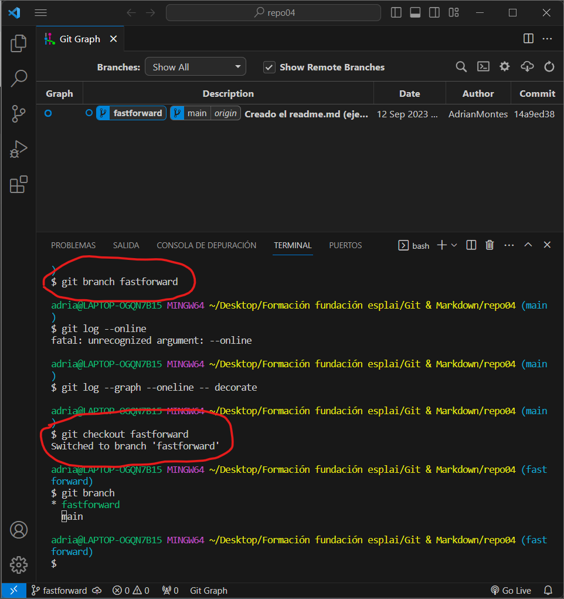
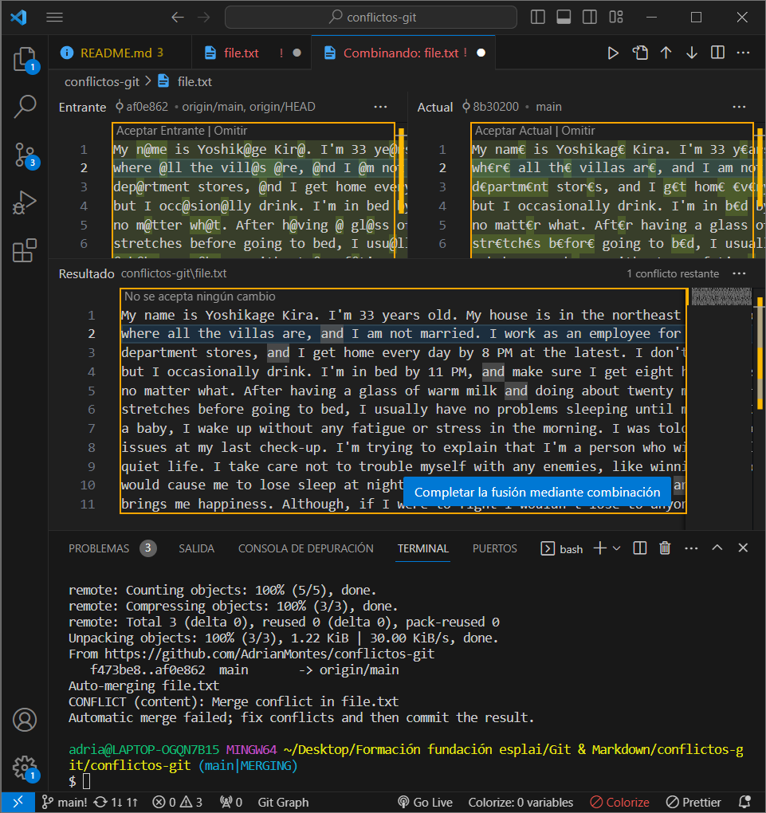
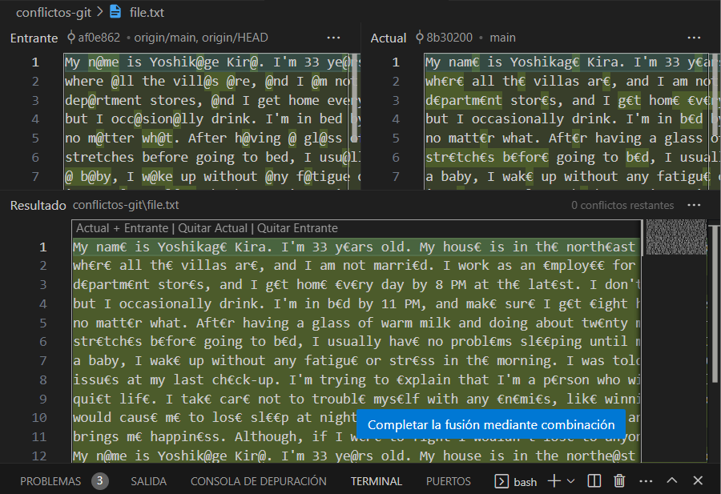

# **Ejercicio 1.1**

Para transformar el directorio en un repositorio local, nos situaremos en el directorio desde la terminal y escribiremos el comando 'git init'. Este comando permitirá iniciar el repositorio.

En la imagen se pueden apreciar dos círculos rojos que indican que el repositorio local se ha creado exitosamente:
- Se crea un archivo llamado ".git" en el directorio.
- En la terminal hay un "(master)" al lado de la dirección del directorio.

---
---
# **Ejercicio 1.2**

La documentación de los ejercicios se hará en un archivo de formato Markdown.

---
---
# **Ejercicio 1.3**

Al crear un archivo en el repositorio, primero tenemos que mover los archivos al staging area. Si no lo hacemos, los archivos saldrán marcados como Untracked.

Para solucionar esto, escribimos por terminal el comando 'git add .', donde se añadirán todos los archivos del directorio al staging area. Si volvemos a comprobar el estado, los archivos saldrán en verde.

Finalmente, para pasarlos al repositorio pondremos el comando 'git commit -m "mensaje"', donde "mensaje" es el comentario que pondremos para el commit. A este punto, el fichero se encuentra en el estado 'commited' del 'file status lifecycle'.

---
---
# **Ejercicio 1.4**

Al escribir el comando 'git push', nos saldrá un error y aparentemente no ocurrirá nada. El problema es que no hemos creado un repositorio en GitHub y tampoco hemos asociado la dirección del mismo.

---
---
# **Ejercicio 1.5**

Al escribir el comando 'git remote -v', no nos aparecerá nada. Esto es normal, ya que no tenemos ningún repositorio remoto asociado.

---
---
# **Ejercicio 1.6**

Una vez creado el repositorio, estos serán los comandos que tendremos que utilizar para asociar el repositorio.

---
---
# **Ejercicio 1.7**

Al escribir de nuevo el comando 'git remote -v', nos saldrá el repositorio remoto asociado. Ahora sí que aparece debido a los comandos que hemos introducido anteriormente.

---
---
# **Ejercicio 1.8**

Aquí he subido todos los cambios que llevamos hasta ahora.

---
---
# **Ejercicio 1.9**

Los cambios se han realizado correctamente desde el repositorio local. La documentación Markdown se mostrará debajo de los archivos subidos.

---
---
# **Ejercicio 2.1**

Repositorio 'repo02' creado. En este caso, se le considera un repositorio remoto debido a que solo se encuentra en GitHub y no tiene un directorio local asociado.

---
---
# **Ejercicio 2.2**

Copiamos la dirección del repositorio remoto de repo01, accedemos a un directorio distinto y escribimos el comando 'git clone "dirección"', donde "dirección" es la dirección del repositorio remoto. Al hacerlo, se nos clonará el repositorio.

---
---
# **Ejercicio 2.3**

Commit realizado en el repositorio clonado.

---
---
# **Ejercicio 2.4: Resumen**
| Comando | Función |
|:--- |:--- |
| git config | Permite configurar el nombre y correo del usuario
| git init | Inicializa el repositorio |
git status | Permite ver el estado de los ficheros |
| git add | Añade los ficheros al staging area |
| git commit | Envía los ficheros añadidos al repositorio local |
| git log | Muestra un historial de los commits |
| git remote add origin | Enlaza el repositorio local con el remoto |
| git branch | Cambia el nombre de la rama |
| git remote -v | Muestra los repositorios remotos asociados |
| git push | Sube los cambios a un repositorio remoto |
| git clone | Clona un repositorio |

---
---
# **Ejercicio 4.1**

Repositorio creado en local y en remoto.

---
---
# **Ejercicio 4.2**

Añadido el fichero readme.md al repositorio remoto.

---
---
# **Ejercicio 4.3**

Para crear una rama, usaremos el comando "git branch fastforward". Esto creará la rama 'fastforward'.

Para pasar a esta rama, insertamos en la terminal "git checkout fastforward". Al escribir este comando, nos localizaremos en la rama 'fastforward'.

---
---
# **Ejercicio 4.4**

Fichero readme.md editado.

---
---
# **Ejercicio 4.5**

Aquí se muestran todos los commits que se han hecho. Como se puede ver, se han hecho 3 commits desde la rama 'fastforward'.

---
---
# **Ejercicio 4.6**

Ahora vamos a fusionar las ramas y realizar los cambios hechos por la rama 'fastforward'. Para hacerlo, cambiaremos a la rama 'main' e introduciremos el comando "git merge fastforward".

A continuación, hacemos un push y los cambios del commit se nos actualizarán en el repositorio remoto.

---
---
# **Ejercicio 4.7**

Eliminamos la rama anteriormente creada con el comando "git branch -d fastforward".

---
---
# **Ejercicio 4.8**

Como se puede comprobar, el comando para eliminar la rama ha funcionado correctamente.

---
---
# **Ejercicio 5.1**

Repositorio local y remoto creados.

---
---
# **Ejercicio 5.2**

Creamos el readme.md dentro del directorio indicado.

---
---
# **Ejercicio 5.3**

Aquí he creado la rama y me he situado en ella.

---
---
# **Ejercicio 5.4**

Commits realizados en la rama indicada.

---
---
# **Ejercicio 5.5**

Antes de hacer el merge, he  realizado los push en cada rama.

---
---
# **Ejercicio 5.6**

Cambiamos a la rama de main e insertamos el comando 'git merge --no-f adrian12092023 -m "Ejemplo NoFF merge"'. Esto fusionará ambas ramas en la principal y todos los cambios de la rama adrian12092023 se aplicarán a la rama main.

---
---
# **Ejercicio 5.7**

Resultado mediante el plugin y la línea de comandos.

---
---
# **Ejercicio 5.8**
La diferencia entre FF y NoFF merges es que en FF se hace todo en una misma rama lineal hacia adelante, mientras que en NoFF, los cambios se van haciendo en ramas diferentes hasta fusionarlas en una misma.

---
---
# **Ejercicio 6**

Para hacer el alias, tendremos que añadirlo al archivo bashrc. Para ello, escribiremos el comando "nano ~/.bashrc" para acceder al fichero y dejaremos el fichero tal cual está en la imagen de arriba. Guardamos con Ctrl + O y salimos del fichero con Ctrl + X.

Al salir del archivo, escribimos "source ~/.bashrc" para recargarlo y aplicar los cambios. Ahora, cada vez que escribamos "gitadog", se nos mostrarán todos los commits; como si escribieramos "git log --all --decorate --oneline --graph".

---
---
# **Conflictos 1**

Creamos un repositorio con un readme incluido.

---
---
# **Conflictos 2**

Contenido copiado del repositorio.

---
---
# **Conflictos 3**

Para clonar el repositorio, tendremos que copiar el enlace del repositorio remoto e insertar el comando "git clone 'enlace'", donde 'enlace' es el enlace del repositorio. Al hacerlo, se nos clonará todo el contenido en el directorio actual. Podemos comprobar también que el repositorio local está enlazado con el remoto con el comando 'git remote -v'.

---
---
# **Conflictos 4**

Readme modificado en el repositorio remoto.

---
---
# **Conflictos 5**

Readme modificado en el repositorio local.

---
---
# **Conflictos 6**

Al intentar hacer un push en el repositorio local al remoto, nos resultará imposible debido a que hay conflictos entre ambos repositorios.

---
---
# **Conflictos 7**

Introducimos 'git pull' y se nos dará a elegir la versión.

---
---
# **Conflictos 8**

En mi caso, he elegido el cambio entrante, ya que me interesaba más la versión del repositorio remoto.

---
---
# **Conflictos extra**

Por un lado, tengo mi repositorio remoto, donde todas las letras 'a' han sido cambiadas por '@'. Por otro lado, tengo mi repositorio local donde las letras 'e' han sido substituidas por '€'.

Para los reemplazos, he usado expresiones regulares.

Esto es lo que ocurre cuando intentamos hacer un 'git pull' desde el repositorio local. Al intentar fusionar los contenidos de ambos repositorios, nos dará el resultado que se muestra en la imagen de arriba.

He intentado combinar ambos repositorios, pero por alguna razón no me es posible.